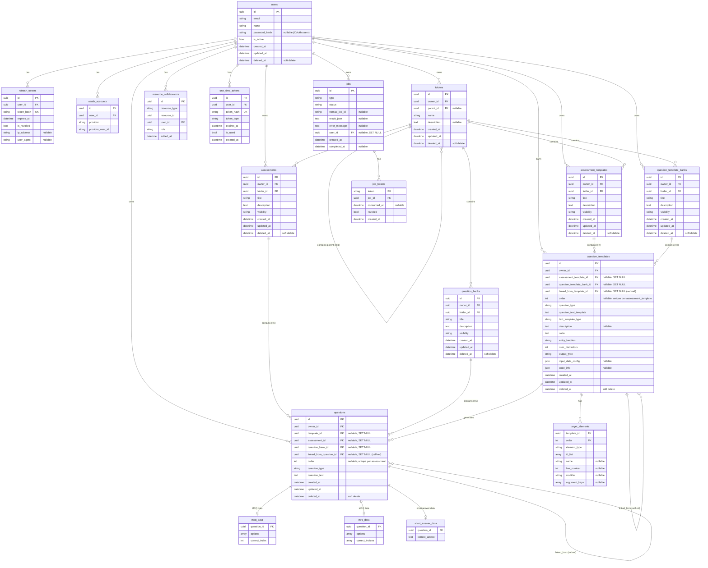

# Database Documentation

This document provides a detailed overview of the database design and schema used.

## 🧱 Overview

- Database: PostgreSQL
- ORM: SQLAlchemy
- Migrations: Alembic

## 📊 Schema Diagram

## 🧩 Core Concepts

### 1. Ownership Model

* Every resource has an **owner (`user_id`)**
* Access control is handled via:

  * ownership
  * collaborators (see API layer)

---

### 2. Folder Hierarchy

* Tree structure (self-referencing)
* Each user has a **root folder**
* Resources live inside folders:

  * assessments
  * question banks
  * templates

---

### 3. Questions & Templates

#### Questions

* Stored in assessments and question banks

#### Question Templates (generation logic)

* Used to generate questions dynamically

---

### 4. Copy-on-Link Pattern

When linking:

* A **new copy is created**
* Original reference is stored
* Copies are independently editable

---

### 5. Ordering

For ordered collections (e.g. assessments):

* 0-indexed
* Always contiguous (0,1,2,...)
* Insert shifts items down
* Deletion re-normalizes order

---

### 6. Async Jobs

The `jobs` table tracks background work:

* `queued → running → completed/failed`
* Stores:

  * result JSON
  * error message
* Linked to Nomad workers via `job_tokens`

## 🧪 Testing Database

* Separate test DB
* Runs in isolated transactions
* Automatically rolled back after tests

## 📌 Notes

* Full schema definitions live in `edcraft_backend/models/`
* Migration history lives in `alembic/versions/`
